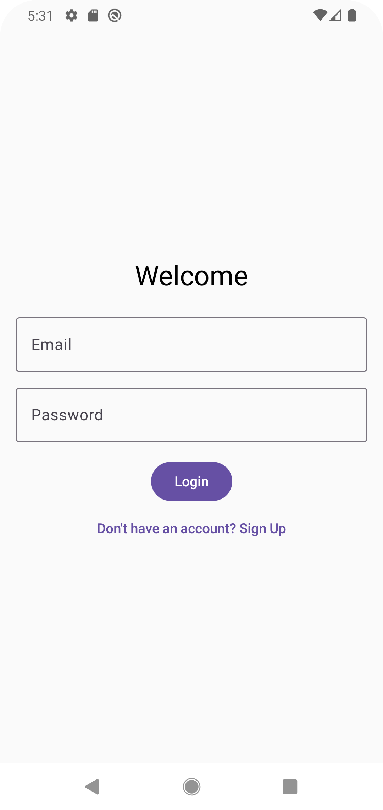
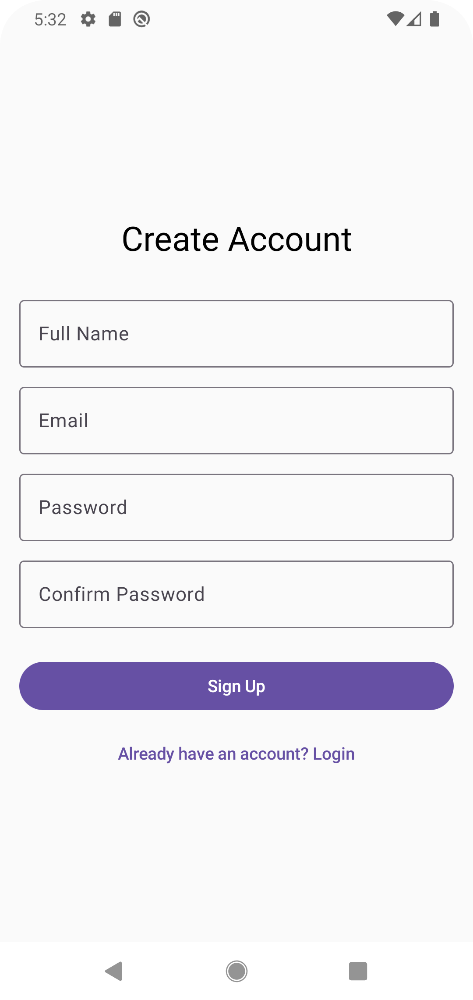
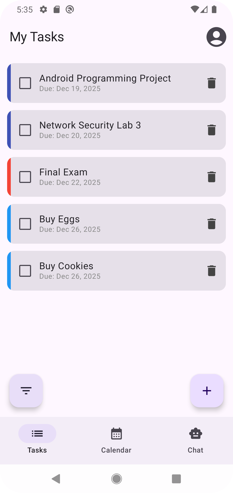
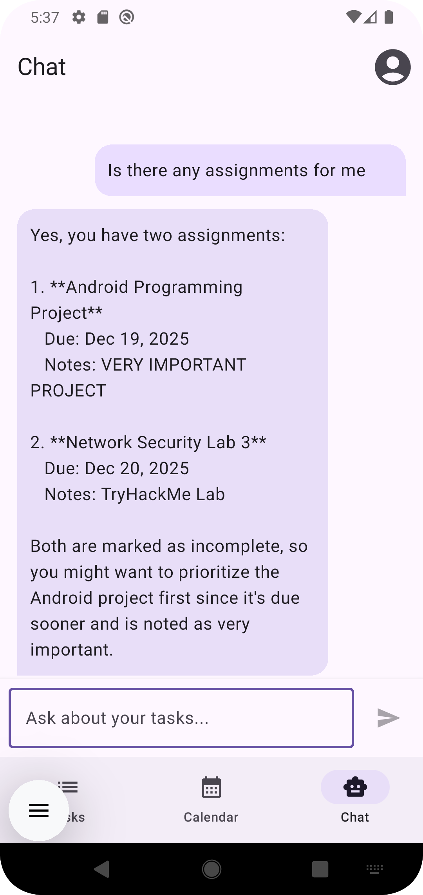
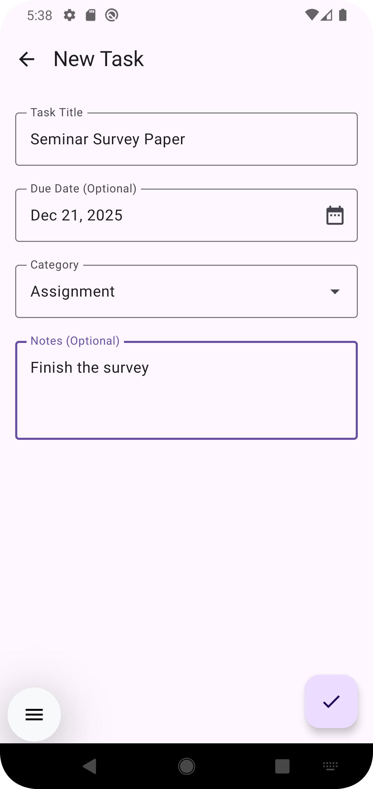
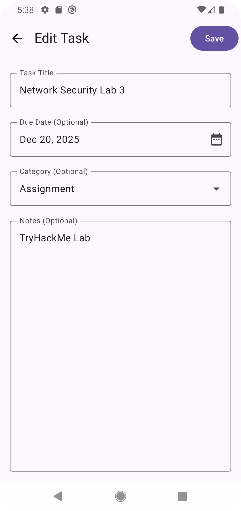
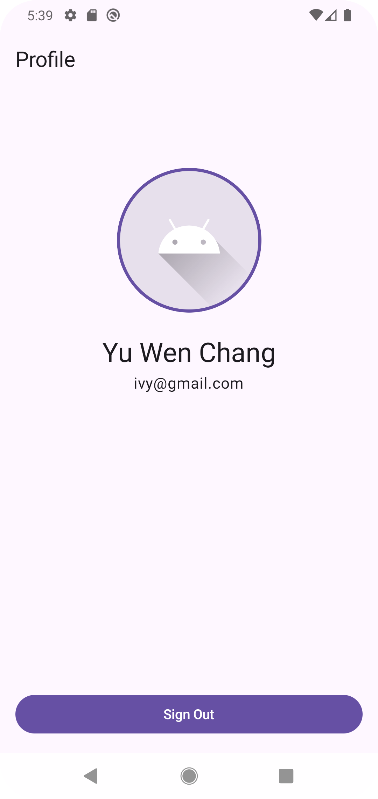
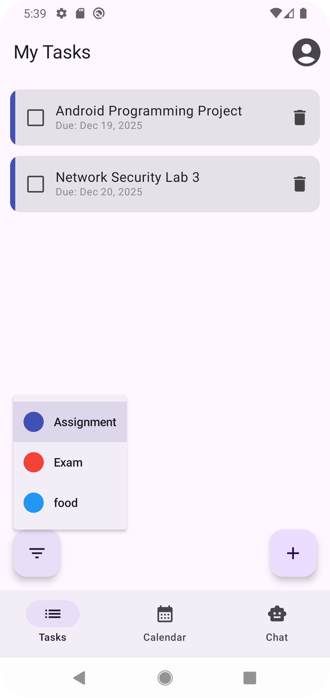

# Android Final Project - Smart Todo & Productivity App

A comprehensive productivity application built with Modern Android Development technologies. This app features offline-first data persistence using Room, secure authentication via Firebase, and an AI-powered chat assistant to help manage tasks.

## Team Members

-   **Timothy Ko** - 875036808
-   **Yu-Wen Chang** - 837917566

---

## Project Overview

This application is designed to meet the requirements of a robust Android application with Authentication, Local Database persistence, and a rich UI built with Jetpack Compose.

It allows users to:

-   Securely Sign Up and Login using Email/Password.
-   Manage Tasks (Create, Read, Update, Delete) with persistent local storage.
-   Organize tasks by custom Categories.
-   View tasks in a List view or a Calendar view.
-   Filter tasks by categories.
-   Chat with an AI Assistant (DeepSeek) that has context about the user's current tasks.
-   Manage their Profile.

## Features & Implementation

### 1. Authentication (Firebase Auth)

-   **Implementation:** Leverages `FirebaseAuth` via an `AuthRepository`.
-   **Features:**
    -   Sign Up with Name, Email, and Password (with validation).
    -   Login with Email and Password.
    -   Persistent login state (Auto-login on app launch).
    -   Sign Out functionality.
    -   Loading states and error handling during auth flows.

### 2. Data Persistence (Room Database)

-   **Implementation:** Uses the Room Persistence Library for offline storage.
-   **Entities:**
    -   `TaskEntity`: Stores task details (title, notes, due date, completion status).
    -   `CategoryEntity`: Stores custom categories (name, color).
-   **Relationships:** Tasks are linked to Categories using Foreign Keys (`TaskWithCategory`).
-   **Reactive Data:** Utilizes `Flow` in DAOs to provide real-time updates to the UI.

### 3. UI Implementation (Jetpack Compose)

-   **Architecture:** Single Activity architecture with Navigation Component.
-   **Design:** Material Design 3 (Material3) theming.
-   **Screens:**
    1.  **Login Screen:** Form for user authentication.
    2.  **Sign Up Screen:** Account creation with validation.
    3.  **Home Screen:** Main dashboard with bottom navigation (Tasks, Calendar, Chat).
    4.  **Task List Screen:** Displays tasks with checkboxes and filtering options.
    5.  **Calendar Screen:** Visualizes tasks on a monthly calendar view.
    6.  **Chat Screen:** AI interface to query task information.
    7.  **New Task Screen:** Form to create tasks with categories and dates.
    8.  **Edit Task Screen:** Update existing task details.
    9.  **Profile Screen:** User details and management.

### 4. Advanced Features

-   **AI Chat Assistant:** Integrated using the OpenAI Client (configured for DeepSeek API). The AI receives the user's current task list as context to answer questions like "What do I need to do today?".
-   **Category Management:** Users can create custom color-coded categories.

---

## Architecture

The app follows the recommended **MVVM (Model-View-ViewModel)** architecture:

-   **UI Layer (View):** Jetpack Compose screens that observe state.
-   **ViewModel Layer:** `HiltViewModel`s that hold `StateFlow`s and handle business logic (e.g., `TaskListViewModel`, `ChatViewModel`).
-   **Data Layer (Repository):** Repositories (`TodoRepository`, `AuthRepository`) that abstract data sources.
-   **Dependency Injection:** **Dagger Hilt** is used for dependency injection throughout the app.

---

## Screenshots

|                            Login                            |                           Sign Up                            |                        Task List                         |
| :---------------------------------------------------------: | :----------------------------------------------------------: | :------------------------------------------------------: |
|  |  |  |

|                            Calendar                            |                         Chat (AI)                          |                        New Task                         |
| :------------------------------------------------------------: | :--------------------------------------------------------: | :-----------------------------------------------------: |
|  |  |  |

|                        Edit Task                         |                            Profile                            |                        Filter Dialog                         |
| :------------------------------------------------------: | :-----------------------------------------------------------: | :----------------------------------------------------------: |
|  |  |  |

---

## Project Setup Guide

To run this project locally, follow these steps:

1.  **Clone the Repository**

    ```bash
    git clone <repository-url>
    ```

2.  **Firebase Setup**

    -   Create a project in the Firebase Console.
    -   Enable **Authentication** (Email/Password provider).
    -   Download `google-services.json` and place it in the `app/` directory.

3.  **API Keys (DeepSeek/OpenAI)**

    -   Obtain an API Key from DeepSeek (or OpenAI).
    -   Open `local.properties` in the root directory.
    -   Add the following line:
        ```properties
        DEEPSEEK_API_KEY=your_api_key_here
        ```

4.  **Build and Run**
    -   Open the project in Android Studio (Ladybug or newer recommended).
    -   Sync Gradle.
    -   Run on an Emulator or Physical Device.

---

## Requirements Checklist

| Requirement          | Status | Implementation Details                              |
| :------------------- | :----: |:----------------------------------------------------|
| **Authentication**   |   ✅   | Email/Password Auth, Persistent State, Validation   |
| **Data Persistence** |   ✅   | Room Database (Tasks & Categories), CRUD, Relations |
| **UI (Compose)**     |   ✅   | 9 Screens, Material3, Navigation, Form Validation   |
| **Architecture**     |   ✅   | MVVM, Repository Pattern, Hilt DI, Coroutines       |
| **Feature Depth**    |   ✅   | Search/Filter, Calendar View, AI Chat               |
| **Code Quality**     |   ✅   | Clean separation of concerns, Type-safe navigation  |
